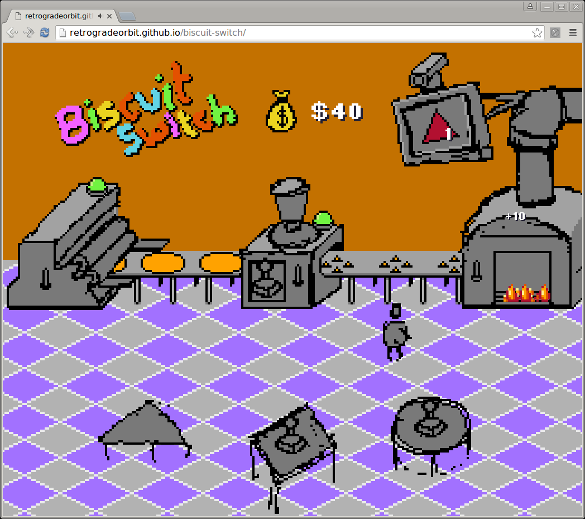

# Biscuit Switch

Entry for LudumDare 35 Compo. Theme was "shapeshifter".

[PLAY IT NOW!](https://retrogradeorbit.github.io/biscuit-switch/)

## Overview

You have started work in the biscuit factory as a shape shifter. Lucky you!

You must keep the production line running. The TV screen barks instructions on what shapes need to be cut to fulfil orders.

You can switch each machine on and off. But you must make sure the right cutter blade shape is loaded into the stamper. Before you can load or unload the stamper, make sure the stamper is off. Then unload the old cutter, if there is one, and place it back on it's table. Take the new cutter stamp from the relevant table and load it into the stamper. Then switch the stamper back on.

If you do well and succeed, then management will deem you worthy of faster work. Keep working! Faster! Faster!

If you lose more than $100, you're fired!

There is no end to the work... just like the real world!

## Controls

Use cursor keys to move your little worker around the floor.

Press space bar to perform actions.

Runs best in google chrome.

## Tools

 - Sounds by jsfxr.
 - Graphics done in aseprite.
 - Code done in clojurescript.

## Development Setup

To get an interactive development environment run:

    lein figwheel

and open your browser at [localhost:3449](http://localhost:3449/).
This will auto compile and send all changes to the browser without the
need to reload. After the compilation process is complete, you will
get a Browser Connected REPL. An easy way to try it is:

    (js/alert "Am I connected?")

and you should see an alert in the browser window.

To clean all compiled files:

    lein clean

To create a production build run:

    lein do clean, cljsbuild once min

And open your browser in `resources/public/index.html`. You will not
get live reloading, nor a REPL.

## License

Copyright © 2014 FIXME

Distributed under the Eclipse Public License either version 1.0 or (at your option) any later version.
